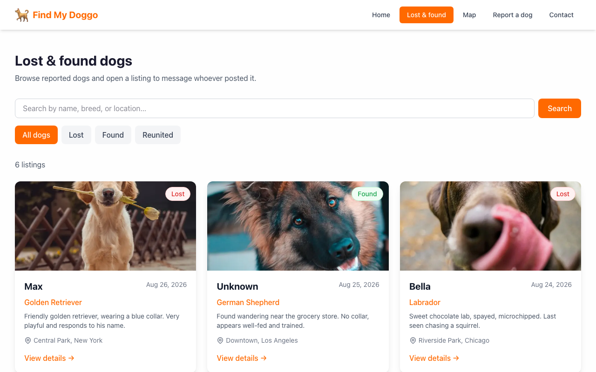

# Find My Doggo

A lost-and-found dog noticeboard: anyone can post a dog with a photo and location,
browse or search the listings, see them on a map, and message the person who
posted. No account, no login.

The design decision that matters is that the reporter's email address, the one
piece of personal data the app holds, never leaves the server. Every read path
goes through `toPublicDog` in `website/src/lib/dogs.ts`, which strips the contact
fields before a record can reach a page, an API response, or the sitemap; enquiries
go through `POST /api/messages`, which resolves the address server-side. A unit
test asserts this directly. Rebuilt as a Next.js app from a 2019 HackMerced
dog-photo classifier, none of which survives in the tree.

<p align="center">
  
</p>

## Quick start

Requires Node.js 20 or newer.

```bash
cd website
npm install
npm run seed     # optional: load six sample listings
npm run dev
```

Open <http://localhost:3000>. No configuration is needed: the app creates a local
SQLite database at `website/data/dev.db` and writes uploaded photos to
`website/data/uploads`.

## How it works

| Concern         | Local development                      | Production                                   |
| --------------- | -------------------------------------- | -------------------------------------------- |
| Database        | SQLite file (`data/dev.db`)            | Hosted libSQL / Turso via `DATABASE_URL`      |
| Photo uploads   | `data/uploads` on disk               | Vercel Blob via `BLOB_READ_WRITE_TOKEN`       |
| Geocoding       | OpenStreetMap Nominatim                | Same (set `GEOCODER_USER_AGENT`)              |
| Map tiles       | OpenStreetMap                          | Same                                          |
| Enquiry emails  | Logged to the console                  | Resend via `RESEND_API_KEY`                   |

Each of these switches over automatically when the relevant environment variable is
present, so the same code runs in both places. Copy `website/.env.example` to
`website/.env.local` to configure them.

`GET /api/health` reports whether the database is reachable and which optional
integrations are actually wired up.

## Project layout

```
website/
├── src/
│   ├── app/
│   │   ├── api/          # REST handlers: dogs, messages, health
│   │   ├── dogs/         # listings and per-dog detail pages
│   │   ├── map/          # Leaflet map view
│   │   ├── report/       # report submission form
│   │   └── contact/      # general contact form
│   ├── components/       # navbar, footer, cards, map, forms
│   └── lib/              # database, validation, storage, geocoding, rate limiting
├── scripts/seed.mjs      # sample listings
└── tests/
    ├── unit/             # Vitest
    └── e2e/              # Playwright
```

## Commands

Run from `website/`:

| Command             | What it does                                        |
| ------------------- | --------------------------------------------------- |
| `npm run dev`       | Development server                                   |
| `npm run build`     | Production build (also typechecks)                   |
| `npm start`         | Serve the production build                           |
| `npm run seed`      | Load sample listings (idempotent)                    |
| `npm run lint`      | ESLint                                               |
| `npm run typecheck` | `tsc --noEmit`                                       |
| `npm test`          | Vitest unit tests                                    |
| `npm run test:e2e`  | Playwright end-to-end tests (needs a build first)    |

## Deploying

The app is a standard Next.js project rooted at `website/`.

1. Create a libSQL database (Turso is the hosted option) and set `DATABASE_URL`
   and `DATABASE_AUTH_TOKEN`. Tables are created on first request.
2. Create a Vercel Blob store and set `BLOB_READ_WRITE_TOKEN`, or photos will be
   written to a filesystem that does not survive a redeploy.
3. Set `RESEND_API_KEY` and `NOTIFY_FROM_EMAIL` so enquiries actually reach the
   people who posted. Without them, messages are stored but nobody is notified.
4. Set `GEOCODER_USER_AGENT` to something identifying with a contact address —
   Nominatim's usage policy requires it.
5. Check `GET /api/health` after deploying.

## Known limitations

These are deliberate gaps, not bugs:

- **No accounts.** Anyone can post, and nobody can edit or delete their own
  listing. Takedowns go through the contact form.
- **No moderation.** Submissions are validated but not reviewed. A public
  deployment needs a moderation queue and abuse reporting.
- **Rate limiting is per-instance.** The in-memory limiter in `lib/rate-limit.ts`
  slows down a single client but does not survive a scale-out. Front it with a
  shared store or a platform WAF rule before opening it up.
- **Overlapping map pins.** Dogs reported close together are hard to click apart
  at low zoom. Marker clustering would fix this.
- **No listing expiry.** Nothing ages out or gets archived automatically.
- **Nominatim rate limits.** Roughly one geocode per second, shared across the
  deployment. A busy site needs a paid geocoder.

## Licence

GPL-3.0. See [LICENSE](LICENSE).
